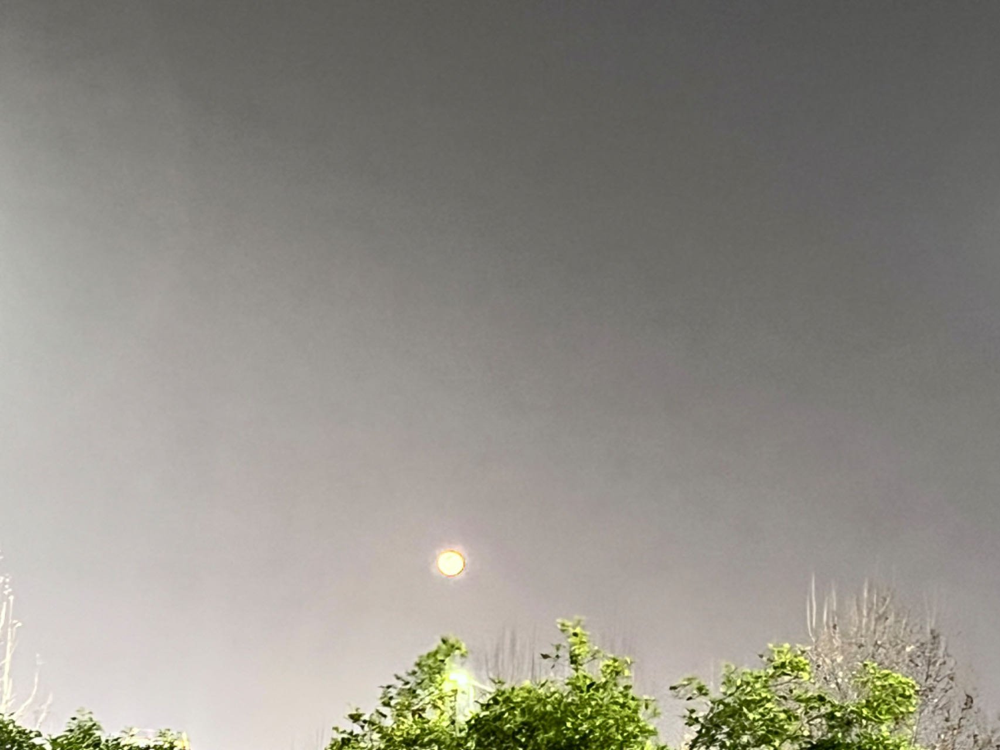

# 写给郑小小的话

青丝发，夜未央，回家的列车哒哒地开，回家的路上睡不着，我知道，脑海中你又会浮现。其实，一直都想整理好思绪，将我的所思所感说给你听。出发前的几个晚上，配着音乐录了视频，但是你不在眼前，说的话也不知道是在说给谁听。我预想，今晚会是一个思恋的高峰期；果不其然，我又想你了，珍着这股思恋翻涌，把一直积压在心头的话都说给你吧。  

时间过去了很久，我又想了你很久，这段时间不在你身边，希望你是开心的，轻松的。上次见完面，很久没联系你，这应该算是一种不负责任。如果确是这样，希望你能体谅。以前，我的心态放的很平，像一片湖，风风雨雨打过，随后总归平静。可是你与风雨不同，你是落花，飘下来时，我开心至极，泛起涟漪，尔后你随流水淌走，我眷恋不舍，湖面虽恢复平静，但湖底却聒噪不已。这段时间，我的状态有点奇怪，需要好好调整下。所以去爬了山，看了湖。我知道，我们见面的次数，牵在一起的左右手就能数的过来，但数尽了春花秋叶，数尽了夏草冬雪，对你的思恋，也还没数完。也很神奇，相处不多，却爱得很深。至少在我的人生里，从没有这种程度地去喜欢一个人。  

我觉得吧，喜欢是简单的，这一生总有你爱慕的人，但相爱的人走到一起，却很难。人们都期盼超越现实的爱情，但没人能跳出现实。而我的忧虑，也正是这所谓的现实。现实让我在第一次见你时，就划好朋友的界限；让我在第三次见你时，警告自己不要靠的太近；也让我在第四次见你时，没有勇气牵起你的手。如果是朋友，我会是轻松的，简单的，可以无顾及地去说去做。可慢慢的我发现，有关于你的事，我没法控制自己。也是突然的一个晚上，半夜睡不着觉，脑子不听话说地浮现出断桥与你表白的画面。恰好第二天在楼下的小屋自习，你一个误会，让我好好准备给你个惊喜。本来我还压抑着自己，那你自己都说了，就借着这个偶然，在小屋给你布置了一个小小的惊喜吧。其次，我也觉得，应该主动去珍惜下身边的人了，虽然我们都身处现实，可总有和现实不同的地方，那也许就是相爱的人最终能在一起的可能性。大学毕业的时候翻书看到一句话：爱一个人不容易，如果你爱的人也爱你，你要知道，这是老天选中了你，给你安排的缘分，抓住这次机会，这也许是此生仅有。对于你，我难得喜欢，第一次就有被吸引，眯眯眼地微笑真的很sweet啊！对于我，曾定好了过25岁，就和青春挥手告别，我本以为青春不会有美丽的爱情，但老天又把你送来我身边。我很庆幸，老来回忆青春的时候，有你结尾。  

我想给你我全部的爱，但我同样觉得，比我的爱更重要的是，你的快乐。我是个入世未久的泛泛之辈，为了争取更好的将来，没留下太多力气去关照身边的人和事。而你，是一只自由的蝴蝶，飞过了许多绝美的风景，有些地方你讲给我听，我不能听懂，但愿意去了解。我想把你留下，但不会织网去捕，我想为你种花，一朵两朵连成片，一片两片搭成园，你想舞动时就舞动，想歇息时就歇息，到处倒是花香，遍地都是色彩，有时你会飞出去看看世界，但也永远会记得回来的路。还记得第一次抱你，第一次和别人的心靠的这么近，我是紧张的，紧张地没站稳，右手扶着柱子，左手拥抱你，心有被触动，心也变得更沉重。因为我突然发现，身上的自由和洒脱，都在急速流走。但也是从那刻开始，我对你的态度更加坚定了。所以，表白的那晚我是明确的，爱都爱了，收得回吗！抱都抱了，忘得掉吗！牵了手，就决定好要陪你走这漫漫人生路了。况且，我若是已经走进了你的内心，那便不会悄悄离开。古人说，欲买杏花同醉酒，终不似，少年游，我很坚定地珍惜当下，珍惜你，不愿你成为将来忆起的遗憾。  

人生路困难在所难免，有勇气说爱你，那就有勇气去克服。其一：我很不愿意去影响，特别是伤害别人。小时候很多事都不记得了，但我清楚地记得我伤害过一只小鸭子，因为自己一时的情绪，伤害到了无辜的弱小。人生最可怕的不是缺乏面对困难的勇气，也不是竭尽全力而无所获，我最怕的是未尽的责任和无法弥补的遗憾。所以啊，我想着我需要有能力，去保护照顾好身边的人，特别是你。有了你，生活的目标更加明确，世界的转动有了轴心。我还在努力着，成为你能放心托付的人。其二：对于恋爱中的那些事，我没法悉数尽知，这段时间甚至还在调整心态，你的日常我应积极回应，但是对于你，我比较敏感，容易东想西想，而且停也停不下来，我需要点时间去把这个领域的胸襟打开。爱你这件事，让我感觉到辛苦和心乱，但这对我来说是正常的，是迟早要经历的。我不怕辛苦，既然已经迈出了那一步，就敢继续走下去，虽然还没找准方向，但只要是爱你，往哪走，都是往前走。之前你说可以去网上刷刷攻略，我比较笨，没刷明白，就去刷了下《小王子》，有句话我想送给你：**你看天上的月，本来对我毫无意义，但是你的出现，让我每次看见它，都会想起你清澈的眼。**  

还有很多话没说完，只是今天的话，我想没法当面说给你，因为你在眼前，脑子容易混乱，或是开心到眩晕，或是思绪乱如丝。但总之，遇见你是值得的，You are a beam of light in my life, a gentle one that slowly calms the beast in my heart.  

最后，送你杭州的小月亮，下班的路上我都跟它说话，它知道我对你有多想念  

-- 曾格

