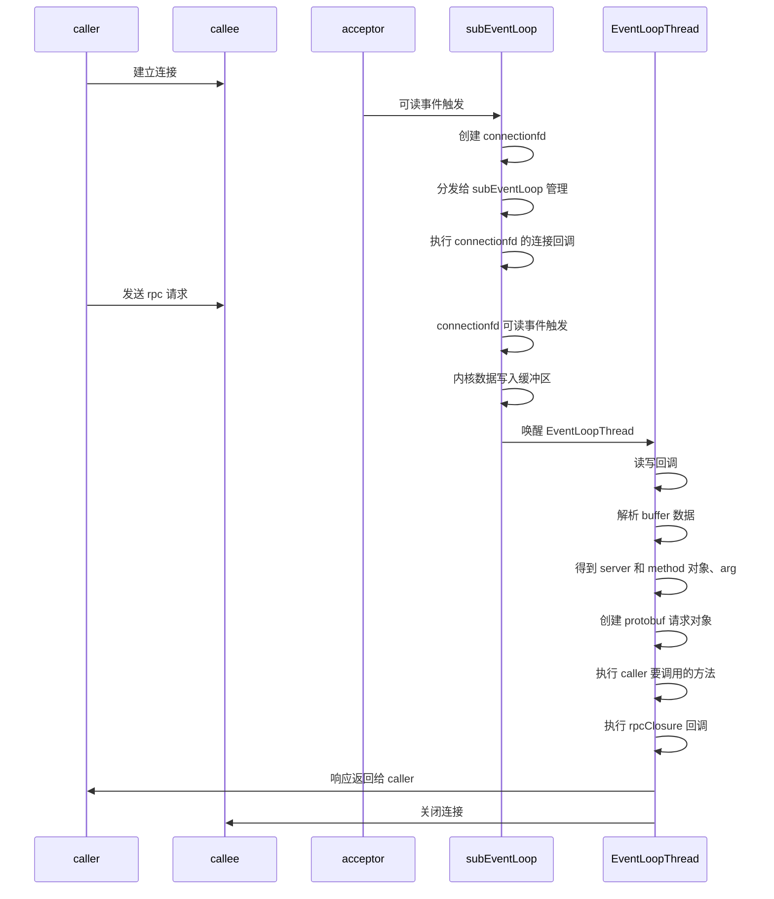

# 核心代码

```mermaid
sequenceDiagram
    participant caller
    participant callee
    participant acceptor
    participant subEventLoop
    participant EventLoopThread

    caller->>callee: 建立连接
    acceptor->>subEventLoop: 可读事件触发
    subEventLoop->>subEventLoop: 创建 connectionfd
    subEventLoop->>subEventLoop: 分发给 subEventLoop 管理
    subEventLoop->>subEventLoop: 执行 connectionfd 的连接回调
    caller->>callee: 发送 rpc 请求
    subEventLoop->>subEventLoop: connectionfd 可读事件触发
    subEventLoop->>subEventLoop: 内核数据写入缓冲区
    subEventLoop->>EventLoopThread: 唤醒 EventLoopThread
    EventLoopThread->>EventLoopThread: 读写回调
    EventLoopThread->>EventLoopThread: 解析 buffer 数据
    EventLoopThread->>EventLoopThread: 得到 server 和 method 对象、arg
    EventLoopThread->>EventLoopThread: 创建 protobuf 请求对象
    EventLoopThread->>EventLoopThread: 执行 caller 要调用的方法
    EventLoopThread->>EventLoopThread: 执行 rpcClosure 回调
    EventLoopThread->>caller: 响应返回给 caller
    EventLoopThread->>callee: 关闭连接
```