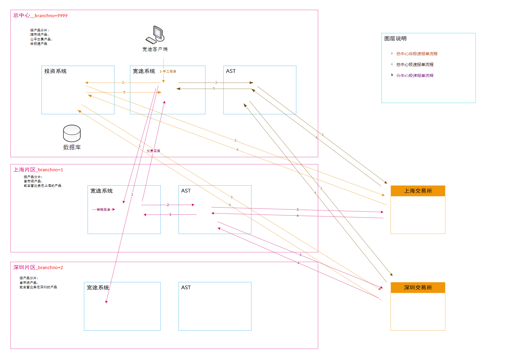
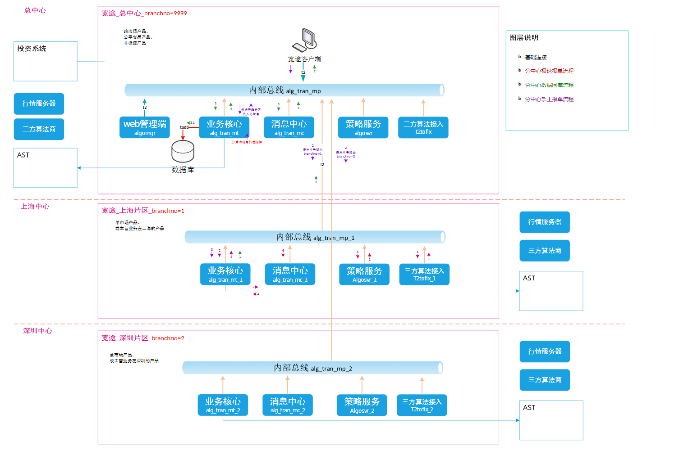
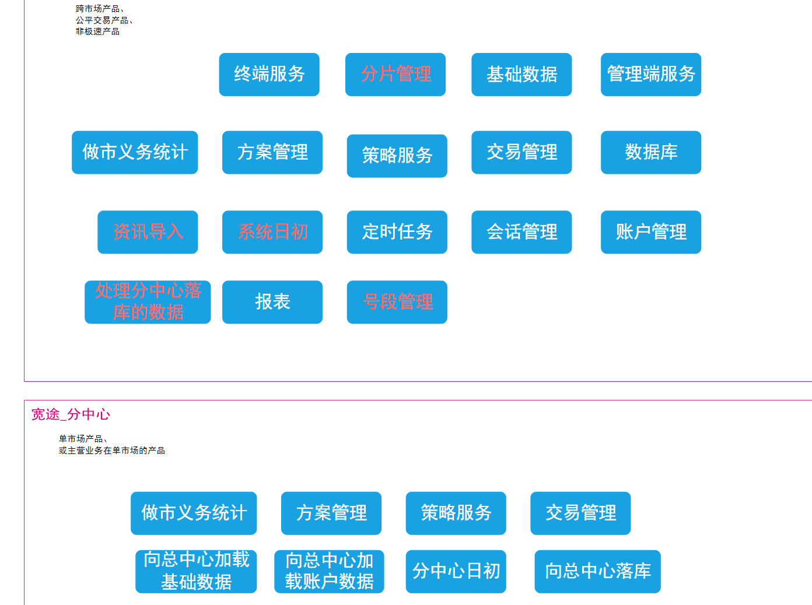
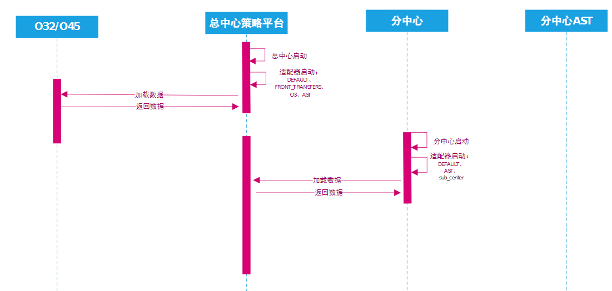
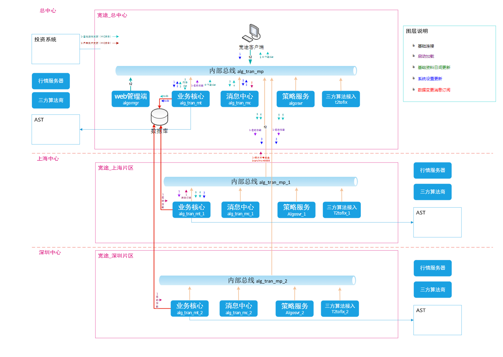
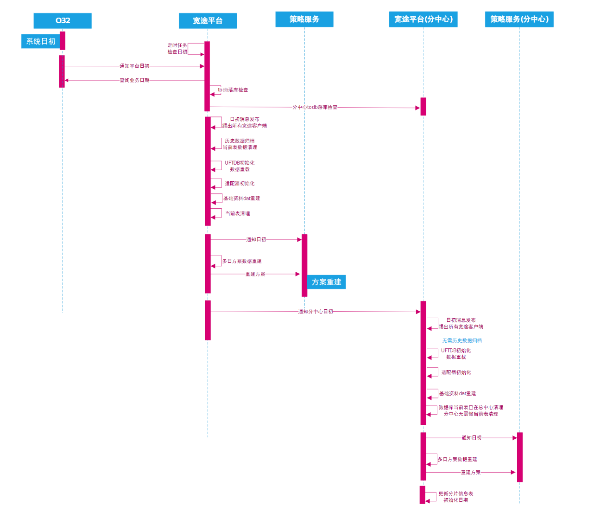
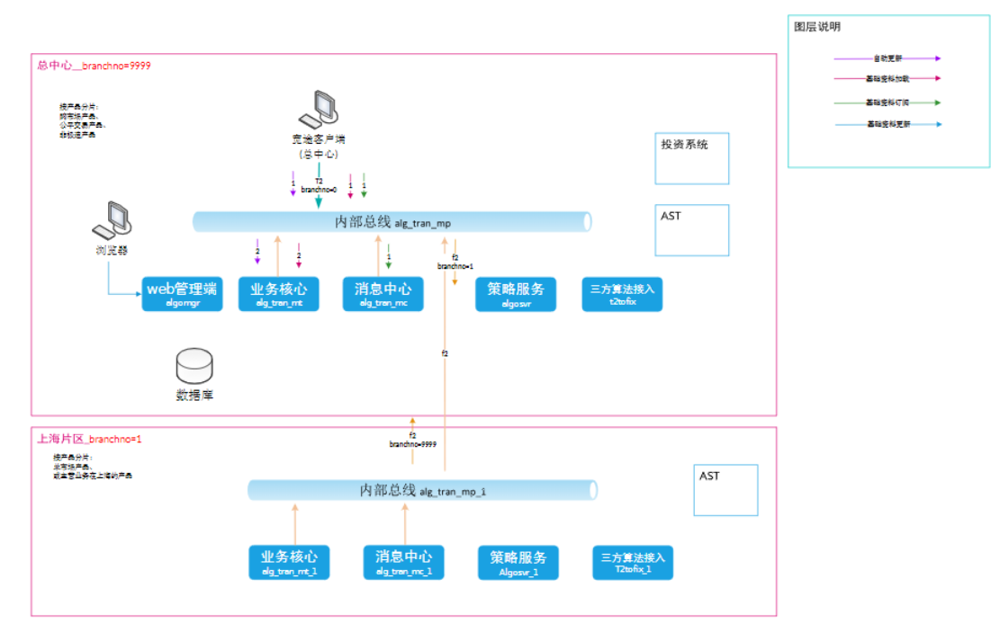
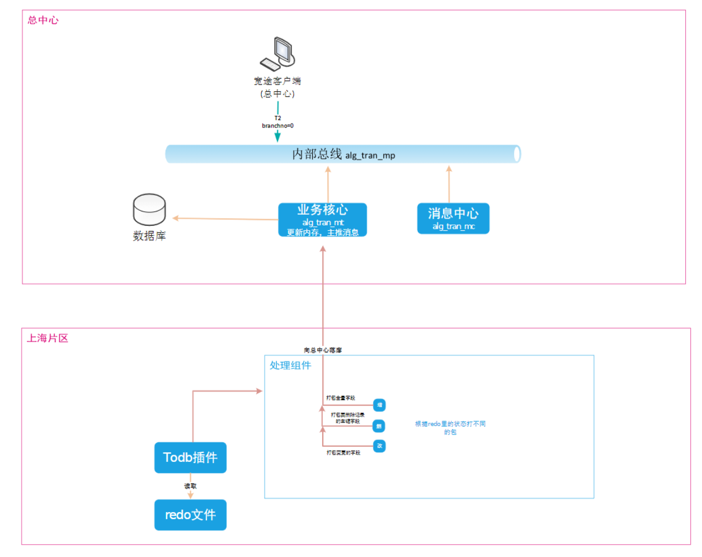
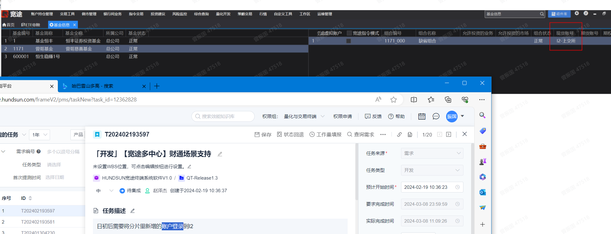

# 多中心对接i2

AST和投资系统的区别，为什么都可以直接对接交易所，而且ast还是极速通道

分中心没有投资系统、数据库，只有ast（有策略报单），分中心只主营单市场产品，或是在上海或北京的产品



总中心开一个客户端能同时操作总中心和分中心的交易



分中心数据回库流程：

分中心数据通过mp转发到总中心 => 总中心mt落库 =>  通过mp发送消息到mc =>  mc发送消息到总中心客户端

分中心报单流程：

algoserver（t2tofix）报单 =>  发送给mt  =>   mt发送给ast  =>  mt回应给algserver


## 分片管理

从分中心切换到总中心立即生效，从总中心切换到分中心需要清流重启分中心节点生效（有策略方案的需要撤掉原方案重新建）。

从总中心切换到分中心，需要重启分中心生效；从分中心切换到总中心，无需重启后台



## 分中心启动加载

分中心启动需要在总中心启动之后再启动，分中心启动后有许多数据需要从总中心加载



分中心的加载，清流从总中心数据库加载（分片号区间），带流是从总中心dat加载？（本地redo加载）

基金信息表，清流从数据库加载，组合信息表，无实体数据库表，分中心从总中心接口加载




## 分中心日初始化

分中心的日初始化需要等总中心日初完成后执行，总中心的日初需要等分中心落库完后进行。分中心日初时只清理内存表，不做数据库历史表归档。分片日初完更新分片信息表的日初日期。



分中心日初的触发

分中心本身有定时10分钟一次任务检查日初。但时间间隔有点久，还需要由总中心日初后主动调用触发分中心的日初。
总中心日初成功后发一个MC消息，各分中心收到消息后主动触发日初。
stp.api.init消息目前是日初前发的，用于日初前踢掉所有宽途客户端。
新增一个总中心日初完成的消息主题（或者直接由总中心异步调用各分中心的日初检查接口）


## 多中心的客户端登录

总中心登录：总中心客户端登录总中心后台，操作总中心的产品的交易，以及报表的查询。总中心客户端需要加载所有的产品信息。
只提供总中心登录的模式



总中心的登录会话信息同步到分中心：走MC推送到各分中心

## 分中心配置参数同步

原则上配置参数修改都是在总中心上进行的，分中心不允许直接修改数据库，总中心修改完配置后需要同步到分中心上

流程：
客户端发起修改请求->总中心系统参数增改接口（402221）->更新数据库tstp_systemparaminfo ->
更新内存表->推送消息stp.api.system_param_change分中心订阅主推消息->更新分中心内存->
推送消息stp.api.system_param_change

消息主推：stp.api.system_param_change
做市配置变更主推：stp.mkt.stockcode


## 分中心序号号段分配

[分片号*1000W ~ (分片号+1)*1000W-1]

目前序列号主要有4类：
- 一类是数据库sequence，该类生成规则保持不变
- 一类是uftdb序列号，参考metadada/serialNumber.xml，该类主要为日间交易序号，每次启动时从当前表里取最大值作为当前序号自增（总中心的启动需求剔除非本中心的记录序号）
- 一类是内存表algojr_tsequence表里保存的序号，主要为算法相关的序号，多日连续另外一类是宽途委托序号entrust_no(需要考虑多套兼容)，表结构需要加分片号字段。  分片号*1000W+seq  

## 分中心向总中心落库

目标：分中心向总中心内存UFTDB落库



分中心只落库交易数据，基础资料由总中心负责落库就行

总的流程比较复杂

## 证券资料变更同步到分中心

分中心不再向O32订阅证券资料变更消息，证券资料由分中心向总中心同步

分中心向总中心订阅基础资料变更的消息收到基础资料变更消息后更新分中心的内存数据
- 分中心向总中心订阅证券资料变更的消息
- 分中心收到证券资料变更的信息，调用总中心的402188接口查询Dat文件列表，比对MD5码是否需要下载文件，
  然后调用总中心402189接口下载Dat文件，然后更新到分中心的workspace/dat目录里，更新分中心的UFTDB内存，
  给分中心的MC推送基础资料变更消息通知分中心的客户端更新。

分中心只做AST通道的交易，不再订阅O32的消息。
O32的交易回报由总中心订阅，总中心的订阅适配器里缓存基金信息表里的分片号和启用标志，对于分中心的委托在适配器调用委托处理功能号（402213-委托下达，402206-委托成交等功能号）传入分片路由，
由mp转发到分中心处理。对于外部委托且基金号未启用的交易消息，直接在适配器里丢弃

前置适配订阅模块收到主推->适配处理->适配器根据产品、委托号等识别出分片号->拼入分片号路由->路由转发到分中心的proc

## 日间持仓同步

各分中心只同步本分区的基金的持仓，通过查询tstp_fund表里的分片号识别是否是本分区的总中心除了同步本中心的产品的持仓，还要同步分中心产品的持仓。
流程：总中心->分中心（通过branchno路由）->AST查询


## 分中心定时任务分配

系统上有些定时任务是只有总中心才需要执行，有些总中心和分中心都需要执行


## 分中心综合查询

## 分中心的适配器

## 总中心的适配器


## 性能指标

AST: 分中心和总中心后台通信带宽：20MTPS:1000笔/秒；
2、委托：确认：成交：撤单：撤成=1:1:1:0.1:0.1；宽途ALGO：每个委托（多个包合计）80kb大小

## I2

通道：快在哪里？委托不还是得发给O3吗？ ast不用吧


## 多中心环境

```
0.0.0.0:13022->22/tcp, 0.0.0.0:1303->1522/tcp, 0.0.0.0:13026->5224/udp, 
0.0.0.0:13027->5226/udp, 0.0.0.0:13028->5227/udp, 0.0.0.0:13029->5231/udp, 
0.0.0.0:13024->8080/tcp, 0.0.0.0:13025->8081/tcp, 0.0.0.0:13030->9003/tcp (mt t2),
0.0.0.0:13031->9009/tcp, 0.0.0.0:13032->15827/tcp, 0.0.0.0:13033->15841/tcp,
0.0.0.0:13047->15844/tcp, 0.0.0.0:13035->15845/tcp, 0.0.0.0:13036->15858/tcp(mp t2), 
0.0.0.0:13037->15859/udp, 0.0.0.0:13038->15860/udp, 0.0.0.0:13039->15901/udp, 
0.0.0.0:13040->15903/udp, 0.0.0.0:13041->15904/udp, 0.0.0.0:13042->15927/udp, 
0.0.0.0:13043->15941/udp, 0.0.0.0:13044->15945/udp, 0.0.0.0:13047->15953/udp, 
0.0.0.0:13045->15958/udp    huhm_zongbu2_dev_ldp_1

0.0.0.0:13149->22/tcp, 0.0.0.0:13123->1522/tcp, 0.0.0.0:13126->5224/udp, 
0.0.0.0:13127->5226/udp, 0.0.0.0:13128->5227/udp, 0.0.0.0:13129->5231/udp, 
0.0.0.0:13148->8080/tcp, 0.0.0.0:13125->8081/tcp, 0.0.0.0:13130->9003/tcp,
0.0.0.0:13131->9009/tcp, 0.0.0.0:13132->15827/tcp, 0.0.0.0:13133->15841/tcp,
0.0.0.0:13147->15844/tcp, 0.0.0.0:13135->15845/tcp, 0.0.0.0:13136->15858/tcp,
0.0.0.0:13137->15859/udp, 0.0.0.0:13138->15860/udp, 0.0.0.0:13139->15901/udp, 
0.0.0.0:13140->15903/udp, 0.0.0.0:13141->15904/udp, 0.0.0.0:13142->15927/udp, 
0.0.0.0:13143->15941/udp, 0.0.0.0:13144->15945/udp, 0.0.0.0:13147->15953/udp, 
0.0.0.0:13145->15958/udp   huhm_sh2_dev_ldp_1

数据库：huhmtest2/huhmtest2@192.168.71.27:1521/orcl
```

## 开发进度

algosrv 还需要配置mp的映射端口

证券交易没有基金，指令需要在O32那边将指令接入模式改成指令

update algojr_texectimeinfo set day_exec_time_range='093000-113000;130000-210000' where market_no=7;


总中心日初完，分中心会跟着日初


分中心也需要license吧


## 问题

1. 基金分片更改218403：

总中心（基金100=>方案1）   =>（基金切换到分中心1，根据数据库tstp_fund的分区号为1，更改数据库后，向客户端发送消息：这个基金切换到分中心1了）    分中心1(基金101=>方案1000002，基金100=>方案100001)
需要将基金100下的方案1在总中心先撤销，然后在分中心新建100001方案(5180999)，

反之流程一样

2. 日初日终后将分片基金账户登录到I2


