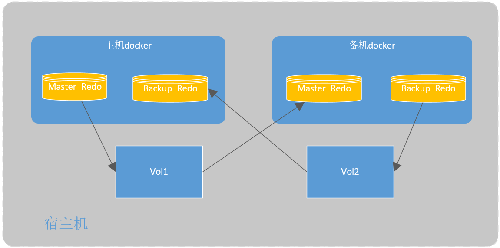

# docker环境

```txt
d9dc81d3ac78   o32_uft:201902A.04_6        "/sbin/sshd -D"    
0.0.0.0:11822->22/tcp, 0.0.0.0:11823->1522/tcp, 0.0.0.0:11824->5123/tcp, 
0.0.0.0:11826->5224/udp, 0.0.0.0:11827->5226/udp, 0.0.0.0:11828->5227/udp, 

0.0.0.0:11837->15859/udp, 0.0.0.0:11838->15860/udp, 0.0.0.0:11839->15901/udp, 

algotran_master:
mp: <0.0.0.0:11836->15858/tcp>,<0.0.0.0:11845->15958/udp>  
mc: <0.0.0.0:11834->15844/tcp>, <0.0.0.0:11844->15945/udp>
mt: <0.0.0.0:11835->15845/tcp>,<0.0.0.0:11846->15953/udp>

algotran:
mp: <0.0.0.0:11833->15841/tcp>,<0.0.0.0:11843->15941/udp> 
mc: <0.0.0.0:11832->15827/tcp>, <0.0.0.0:11842->15927/udp>
mt: <0.0.0.0:11831->9009/tcp>,<0.0.0.0:11841->15904/udp>

algoserver: 先映射出来吧
<0.0.0.0:11830->9003/tcp> ,<0.0.0.0:11840->15903/udp>


algotran_2301:
mp:0.0.0.0:11825->5127/tcp,  0.0.0.0:11829->5231/udp
mt:0.0.0.0:11830->9003/tcp,  0.0.0.0:11839->15901/udp

zzg_qt_zhubei_bei_1


8739cc4cf086   o32_uft:201902A.04_6        "/sbin/sshd -D"        
0.0.0.0:11722->22/tcp, 0.0.0.0:11723->1522/tcp, 0.0.0.0:11724->5123/tcp, 0.0.0.0:11725->5127/tcp, 
0.0.0.0:11726->5224/udp, 0.0.0.0:11727->5226/udp, 0.0.0.0:11728->5227/udp, 0.0.0.0:11729->5231/udp, 
0.0.0.0:11730->9003/tcp, , , , 
0.0.0.0:11734->15844/tcp, 0.0.0.0:11735->15845/tcp, 0.0.0.0:11736->15858/tcp, 0.0.0.0:11737->15859/udp, 
0.0.0.0:11738->15860/udp, 0.0.0.0:11739->15901/udp, 0.0.0.0:11740->15903/udp, 0.0.0.0:11741->15904/udp, 0.0.0.0:11742->15927/udp,
0.0.0.0:11743->15941/udp, , ,   
zzg_qt_zhubei_zhu_1


mp: <0.0.0.0:11733->15841/tcp>, <0.0.0.0:11745->15958/udp >
mc: <0.0.0.0:11732->15827/tcp>, <0.0.0.0:11746->15953/udp>
mt: <0.0.0.0:11731->9009/tcp>, <0.0.0.0:11744->15945/udp>

```


# 主备节点挂载

在生产环境中，赋予一个docker操作系统的权限是一件不安全的事，在不具有系统操作权限的情况下，可借助数据卷进行挂载




1. 创建两个数据卷

```shell
docker volume create vol1
docker volume create vol2
```

2. 创建新容器：
- 主机：将数据卷vol1挂载到主机的`/home/algotran_master/workspace/uftdata`目录，将vol2挂载到主机的`/home/algotran_master/workspace/uftdb_master/uftdata`目录
- 备机：将数据卷vol2挂载到备机的`/home/algotran_backup/workspace/uftdata`目录，将vol1挂载到备机的`/home/algotran_backup/workspace/uftdb_master/uftdata`目录

```shell
# 主机
docker container run -d --name container_name -v vol1:/home/algotran_master/workspace/
uftdata -v vol2:/home/algotran_master/workspace/uftdb_master/uftdata image_name
# 备机
docker container run -d --name container_name -v vol2:/home/algotran_backup/workspace/
uftdata -v vol2:/home/algotran_master/workspace/uftdb_backup/uftdata image_name
```

