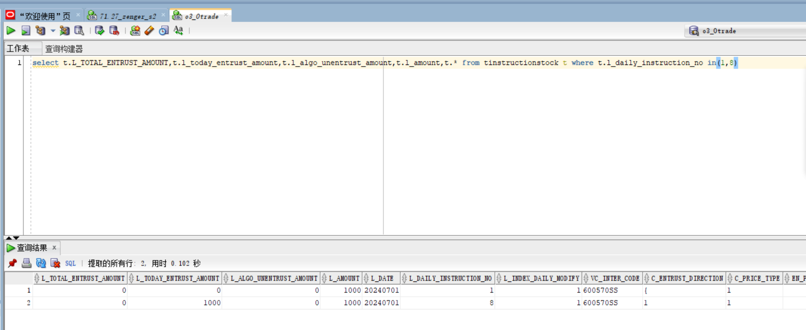

# Linux常用命令

## 压缩：
  - zip:
    - `zip -r appcom_latest.zip ./appcom ./appcom2`
  - unzip:
    - `unzip *.zip -d ./`
  - tar.gz
    - `tar -zxvf fbase2-as4-x64.tar.gz`
    - `tar -zcvf 压缩文件夹名 .tar.gz 被压缩文件名`

## sed

- 删除/n/r中的/r: `sed -i 's/\r$//' ./envCopy.sh`

## 系统
- 查看端口是否被占用
  - `netstat -ano | grep 3306`
- 查看端口对应的程序：
  - lsof -i:8080 或 lsof -i | grep 8080
- 查看送是否有某个函数：`nm -D /path/to/libexample.so | grep 'function_name'`

## 基础命令
- 按时间排序查看：`ll -t`、`ll -rt`
- 替换：
  - `:/src/dst/` 替换当前行第一个
  - `:s/str1/str2/g` 替换当前行所有str1为str2
  - `:n,$s/str1/str2/g` 替换第 n 行开始到最后一行中每一行的第一个str1为str2, 加

## 编译

`sh makeall > build.log 2>&1`

不退出vim，刷新vim打开的文件：`:edit!`,刷新前记得先保存